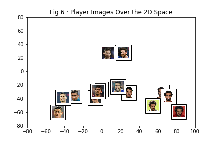

# Image Recognition with Conv Net Using Keras

#### Part I :

**Program a network in Keras with a triplet loss function**

Triplet loss is a learning algorithm for Artificial neural networks where a baseline (anchor) input is compared to a positive (truthy) input and a negative (falsy) input. The distance from the baseline (anchor) input to the positive (truthy) input is minimized, and the distance from the baseline (anchor) input to the negative (falsy) input is maximized. (En.wikipedia.org, 2019)

Figure - Triplet Loss (Schroff et al.)

* Training the Model will give a Embedding Model 

#### Part II :

**Train the network with the MNIST Dataset**

The value of the loss decreses with time as follows :

#### Part III:

**Plot the images of the numbers in the embedding space**

#### Part IV:

**Designed a recognition function to identify the images of numbers**
* I have designed a separate network which will be trained with the embedding model output we get from the previous triplet loss model
* I have also used EMNIST alphabet dataset to create dummy data for unknown label

#### Part V:

**Use of a pretrained Embedding Model using Transfer Learning**

* I have used the VGG Face Model with 22 layers and 37 deep units, the model is developed by the Researchers from the Oxford. I have downloaded the weight and loaded them to a model I have created with the same model construced locally.

     The weight can be found <a href="https://drive.google.com/file/d/1CPSeum3HpopfomUEK1gybeuIVoeJT_Eo/view?usp=sharing">here</a>

     The Original paper can be found <a href="http://www.robots.ox.ac.uk/~vgg/publications/2015/Parkhi15/parkhi15.pdf">here</a>

     The Layer Structure and Image preconstruction I have followed from this <a href="https://sefiks.com/2018/08/06/deep-face-recognition-with-keras/">blog</a>

#### Part VI:

**Use the Model to Create Clustering of Faces**

* I have manually Contructed 16 different images of four players each with size 224 * 224 and placed in the Dataset Folder and get the embedding for the 16 Images(present in the Dataset Folder)
* As we have a 2622 dimensional emedding layer to plot the embedding in 2 Dimensional Space I am using the Dimensionality Reduction Technique PCA with two Principle Component so that I can Plot the Images in 2 D Space
* I have used K-means to cluster the images based on their embeddings
* Use Elbow method to determine the optimal value of K

From Fig 3 and Fig 5 we can see the K-Means Clustered the Images correctly in the same clusters for 4 different players

#### Part VII:

**Face Detection with One Shot Learning**

With the above face embedding we can create a face detector using One Shot Learning, where we will save a single image of each person and compare their embedding with the embedding of the face detected in the camera screen.

One major advantage is we do not have to train the model with new faces, when a new person's image has been added to our database it will automatically compare the embedding with that image and classify it.

 1. Create a database with images captured by the webcam of the laptop
 2. Create embedding Dictionary for the Database Images - create a dictionary of embedding vectors for each image from our database, key will be the name of the file and value will be the embedding vectors
 3. Create the Face Recognition function
     Logic - 
     * Detect the faces with in the camera window
     * For each face detected in the window calculate the embedding and compare the euclidean distance with the images stored in the database
     * Return a match when the euclidean distance is less than a pre-defined threshold
     * This threshold needs to be adjusted according to the data
 4. Detect images through webcam and show the detected labels with the distances

     
